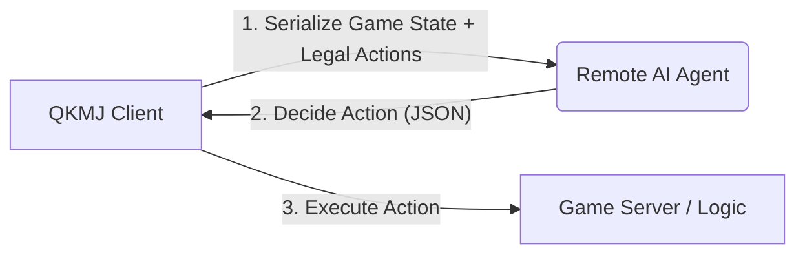

# AI Player Integration Plan (Refined)

This document outlines the plan to refactor QKMJ to support a remote AI Game Play Agent. The client will act as a "dumb terminal" for the logic when AI mode is enabled, gathering the full game state, sending it to a remote brain, and executing the returned commands.

## 1. Architecture Overview



*   **Communication**: HTTP POST (REST API).
*   **Configuration**: controlled by environment variables (e.g., `AI_ENDPOINT`, `AI_MODE=auto|hint`).

## 2. Game Phases & Trigger Points

The AI needs to handle two distinct phases with different action spaces.

### Phase A: Active Turn (Holding 17 Cards)
*   **Context**:
    *   The player has just drawn a card (or executed a sequence of Flower replacements).
    *   The hand contains 17 cards (16 hand + 1 new).
    *   *Note*: Flower replacement happens automatically **before** this phase. The AI is only invoked once the player holds a non-flower card and must make a decision.
*   **Location**: `qkmj.c` -> `gps()` loop -> when `play_mode == THROW_CARD`.
*   **Legal Actions**:
    1.  **Discard**: Throw one card from the hand.
    2.  **An-Kang (Dark Kang)**: Four identical cards in hand.
    3.  **Jia-Kang (Add Kang)**: One card in hand matches an existing exposed Pong.
    4.  **Win (Tsumo)**: Self-picked winning card.

### Phase B: Interrupt/Claim Turn (Other Player Discards)
*   **Context**:
    *   Another player has discarded a card.
    *   The server/client logic has determined this card is claimable (Eat, Pong, Kang, or Win).
    *   Priorities (Win > Pong/Kang > Eat) are enforced by the server/table leader, but the AI must choose its *intent*.
*   **Location**: `checkscr.c` -> `init_check_mode`.
*   **Legal Actions** (Available only if `check_flag` permits):
    1.  **Pass**: Do nothing.
    2.  **Eat**: Claim card for a sequence (might have multiple options, e.g., 2-3 eating 1, or 2-4 eating 3).
    3.  **Pong**: Claim card for a triplet.
    4.  **Kang (Min-Kang)**: Claim card for a quad.
    5.  **Win (Ron)**: Claim card for victory.

## 3. Data Protocol (JSON Schema)

### Request Payload (Client -> Agent)

```json
{
  "cmd": "decision",
  "context": {
    "round_wind": 0,      // 0: East, 1: South...
    "dealer": 1,          // Seat index of dealer
    "my_seat": 1,         // My seat index (1-4)
    "turn_seat": 2,       // Whose turn is it? (If not me, I am interrupting)
    "remain_cards": 88,   // Wall count
    "phase": "discard"    // "discard" (Phase A) or "claim" (Phase B)
  },
  "self": {
    "hand": [11, 12, 13, ...], // Current hidden hand
    "melds": [                 // Exposed melds (Chi/Pong/Kang)
      {"type": "pong", "card": 33, "from": 2}
    ],
    "flowers": [1, 0, 0, 0, ...],
    "money": 10000
  },
  "opponents": [
    {
      "seat": 2,
      "hand_count": 13,
      "melds": [...],
      "discards": [11, 22, 33], // River history
      "flowers": [...]
    }
    // ... players 3 and 4
  ],
  "event": {
    "new_card": 23,       // The card just drawn (Phase A) or discarded by opponent (Phase B)
    "from_seat": 2        // Who discarded it (Phase B only)
  },
  "legal_actions": {      // CRITICAL: What is actually allowed right now?
    "can_discard": true,
    "can_win": false,
    "can_pong": true,
    "can_kang": false,
    "can_eat": [          // Detailed eat options
       [11, 12],          // Eat 13 with 11, 12
       [14, 15]           // Eat 13 with 14, 15
    ]
  }
}
```

### Response Payload (Agent -> Client)

```json
{
  "action": "eat",        // discard, win, pong, kang, eat, pass
  "cards": [11, 12]       // If discard: [card_to_throw]
                          // If eat: [card1, card2] to form set
                          // If pong/kang/win/pass: [] or null
}
```

## 4. Implementation Strategy

### Step 1: HTTP Client (`ai_client.c`)
We will write a simple HTTP client to `POST` JSON to the agent.
*   *Decision*: To avoid complex dependencies like `libcurl` for now, we will use a simple **blocking socket implementation** for HTTP/1.0. It fits the existing `socket.c` style.

### Step 2: State Serialization (`ai_serializer.c`)
A dedicated module to traverse `pool[]`, `player[]`, and `check_flag[]` and build the cJSON object.
*   Must handle the logic to convert internal `check_flag` bitmasks into the `legal_actions` JSON object.

### Step 3: Integration Hooks
*   **Phase A (Discard)**: In `qkmj.c`, locate the input loop where `play_mode == THROW_CARD`. If `AI_MODE` is active, bypass `my_getch()` and call `get_ai_decision()`.
*   **Phase B (Claim)**: In `checkscr.c`, locate `init_check_mode()`. Bypassing the UI menu loop to call `get_ai_decision()`.

## 5. Questions for Approval

1.  **HTTP Implementation**: Are you okay with a custom, lightweight socket-based HTTP sender (to keep the project portable and dependency-light), or do you insist on `libcurl`?
2.  **Endpoint**: I will default to `http://localhost:8888`. Is this acceptable?
3.  **Phase B Logic**: Do you agree with the logic that the AI should receive the specific "Eat Options" (e.g., "Eat with 1,2" vs "Eat with 4,5")? This prevents the AI from suggesting invalid melds.