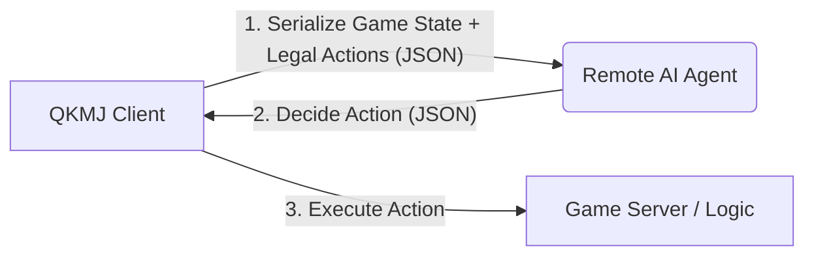

# AI Player Integration

This document outlines the AI Game Play Agent integration for QKMJ. The client acts as a "dumb terminal" when AI mode is enabled, gathering the full game state, sending it to a remote brain, and executing the returned commands.

## 1. Architecture Overview



*   **Communication**: HTTP POST (REST API).
*   **Configuration**: Controlled by environment variables.
    *   `AI_MODE=auto`: Enables AI mode.
    *   `AI_ENDPOINT`: URL of the AI Agent (default: `https://localhost:8888/ask`).

## 2. Game Phases

The AI handles two distinct phases:

### Phase A: Discard Phase
*   **Context**: The player has drawn a card (or replaced a flower) and holds 17 cards. Must discard one or declare Win (Tsumo) / Kang.
*   **Trigger**: `play_mode == THROW_CARD`.

### Phase B: Claim Phase
*   **Context**: Another player has discarded a card. The AI can interrupt to Eat, Pong, Kang, or Win (Ron).
*   **Trigger**: `checkscr.c` interrupt logic.

## 3. Data Protocol (JSON Schema)

### Request Payload (Client -> Agent)

The request contains `cmd: "decision"`, `context`, `event`, `players`, and `legal_actions`.

```json
{
  "cmd": "decision",
  "context": {
    "round_wind": 0,          // 0: East, 1: South, 2: West, 3: North
    "dealer": 1,              // Seat index of dealer (1-4)
    "my_seat": 1,             // My seat index (1-4)
    "turn_seat": 2,           // Whose turn is it right now (1-4)
    "remain_cards": 88,       // Cards remaining in the wall
    "phase": "discard"        // "discard" (Phase A) or "claim" (Phase B)
  },
  "event": {
    "new_card": 23,           // The card just drawn (Phase A) or discarded by opponent (Phase B)
                              // Card ID: 1-9 (Wan), 11-19 (Suo), 21-29 (Tong), 31-34 (Winds), 41-43 (Dragons)
    "from_seat": 2            // Only present in "claim" phase: who discarded the card
  },
  "players": [
    {
      "seat": 1,
      "score": 10000,
      "is_me": true,
      "hand": [11, 12, 13, 23, 23, ...], // Array of card IDs (Only populated for "is_me": true)
      "melds": [              // Exposed melds
        {
          "type": 2,          // 1: Chi, 2: Pong, 3: Min-Kang, 11: An-Kang, 12: Jia-Kang
          "card": 33          // Representative card of the meld
        }
      ],
      "flowers": [0, 1],      // Array of flower indices (0-7) possessed
      "discards": [],         // (Placeholder) History of discards
      "hand_count": 13        // Number of cards in hand (Only for "is_me": false)
    },
    // ... players 2, 3, 4
  ],
  "legal_actions": {
    "can_discard": true,      // True in "discard" phase
    "can_win": false,         // Can I declare Hu/Win?
    "can_eat": false,         // Can I Chi/Eat? (Only in "claim" phase)
    "can_pong": true,         // Can I Pong? (Only in "claim" phase)
    "can_kang": false         // Can I Kang? (Only in "claim" phase)
  }
}
```

### Response Payload (Agent -> Client)

The agent must return a JSON object describing the chosen action.

```json
{
  "action": "pong",           // "discard", "eat", "pong", "kang", "win", or "pass"
  "card": 23,                 // Required for "discard" (which card to throw).
                              // Ignored for "pass", "win".
  
  "meld_cards": [23, 23]      // Optional/Conditional.
                              // For "eat": The two cards from MY hand to form the sequence.
                              //    e.g. if event card is 23, and I eat with 21, 22, this should be [21, 22].
}
```

## 4. Client Commands

*   `/AI ON`: Enable AI mode (Client plays automatically).
*   `/AI OFF`: Disable AI mode.
*   Indicators:
    *   **Local**: Status message "開啟 AI 模式".
    *   **Remote**: Other players see `(AI)` next to the player's name.

## 5. Logging

*   **AI Log**: All AI interactions (Request/Response) are logged to the MongoDB `logs` collection with `level: "ai_trace"`.
*   **Game Log**: Game results are logged with `level: "game"`.
